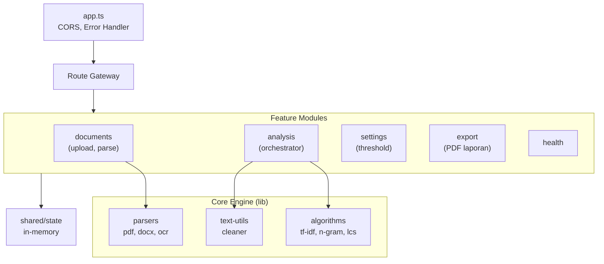
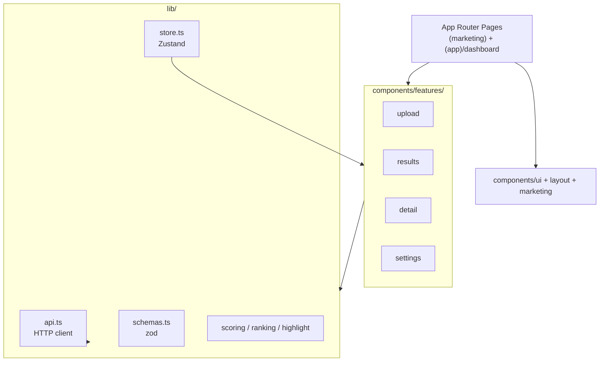
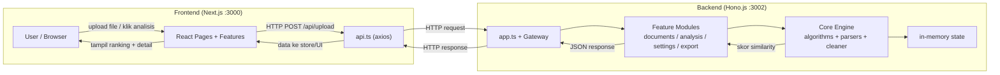

# Plagiarism Checker (Monorepo)

Aplikasi web modern untuk mendeteksi plagiarisme tugas mahasiswa secara massal (_bulk_). Menerima unggahan banyak file `.txt`, `.docx`, dan `.pdf`, lalu membandingkan setiap pasangan file untuk menghasilkan peringkat kemiripan (_similarity ranking_) serta indikasi relasi antar dokumen secara instan.

Ditenagai oleh **Bun** sebagai runtime, **Hono.js** di backend, dan **Next.js** di frontend.

---

## Fitur Utama

- **Unggahan Massal:** Hingga 200 file sekaligus (maks. 10MB/file), format `.txt`, `.docx`, `.pdf`
- **Analisis Multi-Metrik:**
  - **Similarity Normal** — TF-IDF Cosine Similarity (70%) + 5-Gram Overlap (30%)
  - **Similarity Strict** — Membersihkan header identitas (Nama, NIM, Kelas) dan kata template tugas sebelum dihitung
  - **Word Overlap** — Pencocokan kata eksak via LCS (Longest Common Subsequence)
- **Ranking per File** — Tabel ranking dengan status similarity dan metadata
- **Graph/Heatmap Interaktif** — Visualisasi jaringan pasangan file dengan node dan edge
- **Detail Perbandingan (Pair Comparison):**
  - Tampilan side-by-side dengan highlight sinkron kiri-kanan
  - Sinkronisasi scroll otomatis
  - Navigasi antar bagian yang mirip
- **Deteksi Arah Plagiarisme** — Heuristik berdasarkan panjang dokumen dan metadata waktu
- **Ekstraksi Metadata** — Author, created date, modified date dari `.docx` dan `.pdf`
- **Fallback OCR** — Otomatis memproses scanned PDF via `scribe.js-ocr` (bahasa Indonesia + Inggris)
- **Export PDF** — Unduh laporan ringkasan dalam bentuk tabel
- **Pengaturan Threshold** — Batas aman/waspada/bahaya yang bisa dikustomisasi
- **Pengecualian per Mata Kuliah** — Kata-kata yang diabaikan saat mode strict
- **Reset Data** — Tombol reset di header untuk membersihkan semua data upload & hasil

---

## Status Dokumen

Setiap file memiliki **2 level pengecekan status**:

### 1. Status Similarity (berdasarkan skor kemiripan tertinggi)

| Skor Similarity | Status | Warna |
|-----------------|--------|-------|
| `< 60%` | **Aman** | Hijau |
| `60% - 79%` | Plagiarisme Sedang | Kuning |
| `>= 80%` | Plagiarisme Tinggi | Merah |

> Threshold ini bisa diubah di halaman **Settings** (default: aman < 60%, waspada 60-79%, bahaya >= 80%).

### 2. Status Metadata (berdasarkan konsistensi author)

| Kondisi | Status | Keterangan |
|---------|--------|------------|
| `lastModifiedBy` **sama** dengan `author/creator` | **Aman** | Dokumen diedit oleh pembuat asli |
| `lastModifiedBy` **berbeda** dengan `author/creator` | **Mencurigakan** | Kemungkinan dokumen diedit/disalin oleh orang lain |
| Metadata tidak lengkap/kosong | **Aman** | Tidak bisa diverifikasi, ditandai "Metadata tidak lengkap" |

**Contoh kasus mencurigakan:**
- File A: author = "Ahmad", lastModifiedBy = "Budi" → **Mencurigakan** (Budi mengedit dokumen Ahmad)
- File B: author = "Siti", lastModifiedBy = "Siti" → **Aman** (konsisten)

---

## Arsitektur Sistem

### Diagram Backend (Hono.js :3002)



### Diagram Frontend (Next.js :3000)



### Diagram Gabungan — Alur BE ⇄ FE



**Alur singkat:** User upload file di FE → FE kirim ke `/api/upload` → BE parse & simpan di memory → FE minta `/api/analyze` → BE hitung similarity (TF-IDF/LCS) → FE tampilkan ranking, graph, dan detail perbandingan.

## Struktur Folder

```
plagiarism-checker/
├── .env.example                  # Template environment variables
├── package.json                  # Workspace root + scripts
├── bun.lock                      # Lockfile workspace
├── README.md                     # Dokumentasi utama
├── AGENTS.md                     # Panduan pengembang AI
├── .husky/                       # Git hooks (pre-commit, commit-msg)
├── commitlint.config.cjs         # Commit message lint rules
│
├── backend/                      # Hono.js API Server
│   ├── .env / .env.example
│   ├── package.json / tsconfig.json
│   ├── src/
│   │   ├── index.ts              # Entry point (re-export app)
│   │   ├── app.ts                # Hono setup, CORS, error handler, routes
│   │   ├── lib/                  # CORE ENGINE — pure logic
│   │   │   ├── algorithms/       # tf-idf, n-gram, lcs
│   │   │   ├── parsers/          # pdf, docx, txt, ocr
│   │   │   └── text-utils/       # text cleaner (normal/strict)
│   │   ├── features/             # API LAYER — feature modules
│   │   │   ├── analysis/         # similarity orchestration
│   │   │   ├── documents/        # upload + file parsing
│   │   │   ├── export/           # PDF report generation
│   │   │   ├── health/           # health check endpoint
│   │   │   └── settings/         # threshold + course exclusions
│   │   ├── shared/               # cross-cutting concerns
│   │   │   ├── errors/           # AppError + HTTP error handler
│   │   │   ├── middleware/       # request ID middleware
│   │   │   ├── state/            # in-memory app state
│   │   │   ├── types/            # type declarations
│   │   │   └── utils/            # logger, response helpers
│   │   └── db/                   # optional SQLite stub
│   └── tests/                    # fixture-based integration tests
│       ├── fixtures.ts           # helper: baca file dari assets/
│       ├── parser.test.ts        # test parser dengan file nyata
│       └── analysis-pipeline.test.ts  # end-to-end pipeline test
│
── frontend/                     # Next.js Web App
│   ├── .env / .env.example
│   ├── package.json / tsconfig.json / next.config.ts
│   └── src/
│       ├── components/           # UI components
│       ├── lib/                  # api client, schemas, store
│       └── app/                  # Next.js App Router pages
│           ├── page.tsx          # Dashboard utama
│           ├── settings/         # Settings page
│           └── detail/[idA]/[idB]/  # Pair comparison detail
│
└── assets/
    └── files/                    # Fixture file untuk integration test
```

---

## Tech Stack

### Backend (`/backend`)

| Komponen | Library | Versi |
|----------|---------|-------|
| Runtime | Bun | v1.2+ |
| Web Framework | Hono.js | ^4.12 |
| DOCX Parser | mammoth | ^1.12 |
| PDF Parser | pdf-parse | ^2.4 |
| OCR Engine | scribe.js-ocr | ^0.11 |
| PDF Export | pdfkit | ^0.18 |
| XML Parser | xml2js | ^0.6 |
| ZIP Handler | jszip | ^3.10 |
| TypeScript | typescript | ^6.0 |

### Frontend (`/frontend`)

| Komponen | Library | Versi |
|----------|---------|-------|
| Framework | Next.js | ^16.2 |
| UI Library | React | ^19.2 |
| Styling | Tailwind CSS | ^4 |
| State Management | Zustand | ^5.0 |
| Data Fetching | TanStack Query | ^5.10 |
| HTTP Client | axios | ^1.16 |
| Icons | lucide-react | ^1.16 |
| Validation | zod | ^4.4 |
| TypeScript | typescript | ^5 |

---

## Cara Menjalankan

### Prasyarat

- **Bun** v1.2+ — [Install Bun](https://bun.sh)
  ```bash
  curl -fsSL https://bun.sh/install | bash
  ```

### 1. Clone & Install

```bash
# Clone repositori
git clone <repository-url>
cd plagiarism-checker

# Install semua dependencies (root + workspace)
bun install
```

### 2. Konfigurasi Environment

Copy file `.env.example` ke `.env` di masing-masing folder:

```bash
# Root
cp .env.example .env

# Backend
cp backend/.env.example backend/.env

# Frontend
cp frontend/.env.example frontend/.env
```

**Default konfigurasi:**

| File | Variable | Default | Keterangan |
|------|----------|---------|------------|
| `.env` (root) | — | — | Tidak dipakai langsung, referensi saja |
| `backend/.env` | `BACKEND_PORT` | `3002` | Port API server |
| `frontend/.env` | `FRONTEND_PORT` | `3000` | Port Next.js dev server |
| `frontend/.env` | `NEXT_PUBLIC_API_URL` | `http://localhost:3002/api` | URL backend API |

### 3. Jalankan Development Server

**Opsi A: Concurrent (Direkomendasikan)**

Satu perintah untuk menjalankan backend + frontend sekaligus:

```bash
bun run dev
```

Terminal akan menampilkan log kedua server dengan warna berbeda:
- 🔵 **BACKEND** — Hono.js di `http://localhost:3002`
- 🟢 **FRONTEND** — Next.js di `http://localhost:3000`

Tekan `Ctrl + C` untuk menghentikan keduanya.

**Opsi B: Terpisah**

```bash
# Terminal 1 - Backend
bun run dev:be

# Terminal 2 - Frontend
bun run dev:fe
```

**Opsi C: Manual per folder**

```bash
# Backend
cd backend
bun run dev

# Frontend
cd frontend
bun run dev
```

### 4. Akses Aplikasi

Buka browser di **`http://localhost:3000`**

---

## API Endpoints

| Method | Path | Deskripsi |
|--------|------|-----------|
| `POST` | `/api/upload` | Upload file (multipart/form-data, key: `files`) |
| `POST` | `/api/analyze` | Jalankan analisis similarity (query: `?course=nama`) |
| `GET` | `/api/results` | Ambil hasil analisis (query: `?threshold=60`) |
| `GET` | `/api/ranking` | Ambil ranking per file dengan status metadata |
| `GET` | `/api/graph` | Ambil data node & edge untuk visualisasi graph |
| `GET` | `/api/pair/:idA/:idB` | Detail perbandingan satu pasangan file |
| `GET` | `/api/export/pdf` | Download laporan PDF (summary + ranking + pasangan) |
| `POST` | `/api/reset` | Reset semua data upload & hasil |
| `GET` | `/api/settings` | Ambil pengaturan threshold & pengecualian |
| `PUT` | `/api/settings` | Update pengaturan threshold |
| `POST` | `/api/settings/exclusions` | Tambah/update pengecualian per mata kuliah |

---

## Algoritma Kemiripan

### Normal Mode
```
Score = (TF-IDF Cosine Similarity × 0.7) + (5-Gram Overlap × 0.3)
```

### Strict Mode
Sama seperti Normal, tapi teks dibersihkan dulu dari:
- Header identitas: Nama, NIM, Kelas, Dosen, Mata Kuliah
- Template tugas: Pendahuluan, Kesimpulan, Daftar Pustaka, Bab I/II/III
- Kata pengecualian kustom per mata kuliah

### Word Overlap
```
Overlap = |A  B| / min(|A|, |B|)
```
Menghitung rasio kata yang sama persis antara dua dokumen.

### Deteksi Arah Plagiarisme
Heuristik berdasarkan:
1. **Panjang dokumen** — Dokumen lebih pendek kemungkinan menyalin dari yang lebih panjang
2. **Metadata waktu** — Dokumen dengan `created` date lebih lama kemungkinan sumber asli

---

## Batasan

- Maks **200 file per batch**, maks **10MB per file**
- Format didukung: `.txt`, `.docx`, `.pdf`
- **In-memory storage** — data hilang saat server restart
- Tanpa autentikasi atau database
- Deteksi arah plagiarisme bersifat **heuristik**, bukan bukti mutlak
- OCR bergantung pada kualitas scan PDF
- File dengan nama sama **tidak dibandingkan** (dilewati otomatis)

---

## Development Scripts

| Command | Deskripsi |
|---------|-----------|
| `bun run dev` | Jalankan backend + frontend bersamaan |
| `bun run dev:be` | Jalankan backend saja |
| `bun run dev:fe` | Jalankan frontend saja |

---

## Lisensi

Proyek ini dibuat untuk keperluan akademik.
