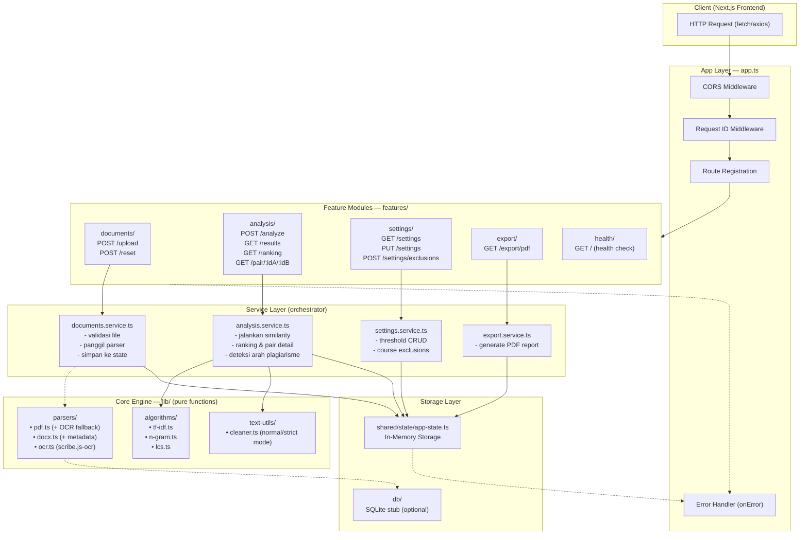
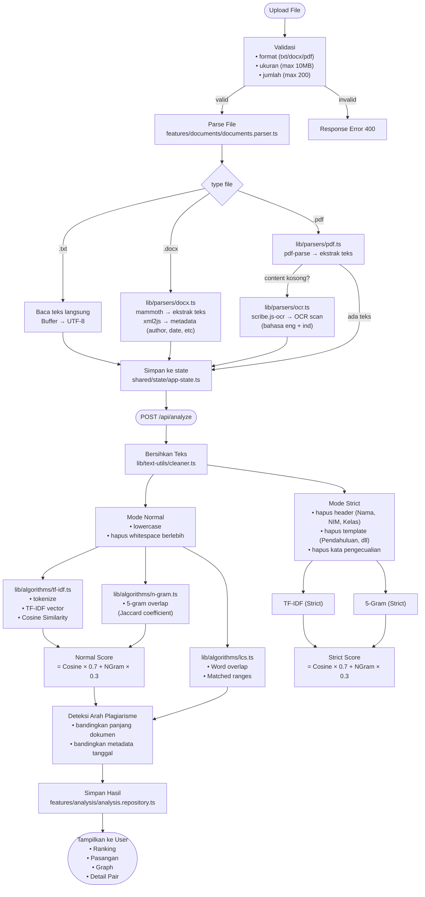

# Backend — Plagiarism Checker API

Backend API untuk deteksi plagiarisme tugas mahasiswa. Dibangun dengan **Hono.js** di atas **Bun** runtime.

```
bun run dev    → Dev server (hot reload)
bun start      → Production server
bun test       → Jalankan semua test
```

---

## Arsitektur Sistem



---

## Alur Proses Analisis



---

## Struktur Folder

```
backend/
├── .env.example                  # Template environment
├── package.json                  # Dependencies & scripts
├── tsconfig.json                 # TypeScript config
│
├── src/
│   ├── index.ts                  # Entry point: re-export dari app.ts
│   ├── app.ts                    # Hono setup: CORS, error handler, route mount
│   │
│   ├── lib/                      # CORE ENGINE — pure logic, tidak tahu soal HTTP
│   │   ├── algorithms/           # Algoritma similarity
│   │   │   ├── tf-idf.ts         # TF-IDF + Cosine Similarity + Similarity Matrix
│   │   │   ├── n-gram.ts         # 5-Gram Overlap + Weighted N-Gram
│   │   │   └── lcs.ts            # LCS Word Overlap + Matched Ranges
│   │   ├── parsers/              # Ekstraksi dokumen
│   │   │   ├── pdf.ts            # PDF text extraction + OCR fallback
│   │   │   ├── docx.ts           # DOCX content + metadata extraction
│   │   │   └── ocr.ts            # OCR wrapper (scribe.js-ocr)
│   │   └── text-utils/           # Pembersih teks
│   │       └── cleaner.ts        # Mode Normal/Strict + cleanup
│   │
│   ├── features/                 # API LAYER — berbasis fitur
│   │   ├── analysis/             # Similarity analysis
│   │   │   ├── analysis.route.ts       # Endpoint definitions
│   │   │   ├── analysis.handler.ts     # Request/response handling
│   │   │   ├── analysis.service.ts     # Orchestrator logic
│   │   │   ├── analysis.schema.ts      # Zod validation
│   │   │   ├── analysis.repository.ts  # State access
│   │   │   ├── analysis.types.ts       # Type definitions
│   │   │   └── similarity.service.ts   # Core similarity computation
│   │   │
│   │   ├── documents/            # File upload & parsing
│   │   │   ├── documents.route.ts
│   │   │   ├── documents.handler.ts
│   │   │   ├── documents.service.ts
│   │   │   ├── documents.parser.ts     # Delegasi ke lib/parsers
│   │   │   ├── documents.schema.ts
│   │   │   ├── documents.repository.ts
│   │   │   └── documents.types.ts
│   │   │
│   │   ├── export/               # PDF report generation
│   │   │   ├── export.route.ts
│   │   │   ├── export.handler.ts
│   │   │   ├── export.service.ts       # generate PDF via pdfkit
│   │   │   ├── export.schema.ts
│   │   │   ├── export.repository.ts
│   │   │   └── export.types.ts
│   │   │
│   │   ├── health/               # Health check
│   │   │   ├── health.route.ts
│   │   │   ├── health.handler.ts
│   │   │   ├── health.service.ts
│   │   │   ├── health.schema.ts
│   │   │   ├── health.repository.ts
│   │   │   └── health.types.ts
│   │   │
│   │   └── settings/             # Threshold & exclusions
│   │       ├── settings.route.ts
│   │       ├── settings.handler.ts
│   │       ├── settings.service.ts
│   │       ├── settings.schema.ts
│   │       ├── settings.repository.ts
│   │       └── settings.types.ts
│   │
│   ├── shared/                   # Cross-cutting concerns
│   │   ├── errors/               # AppError + HTTP error handler
│   │   ├── middleware/           # Request ID middleware
│   │   ├── state/                # In-memory app state
│   │   ├── types/                # Ambient type declarations
│   │   └── utils/                # Logger + response helpers
│   │
│   └── db/                       # Database stub (opsional)
│       ├── connection.ts         # Bun:sqlite koneksi (null default)
│       └── schema.sql            # Raw SQL schema untuk future migration
│
└── tests/                        # Integration & fixture tests
    ├── fixtures.ts               # Helper: baca file dari ../../assets/files
    ├── parser.test.ts            # Test parser dengan file nyata (.txt/.docx/.pdf)
    └── analysis-pipeline.test.ts # End-to-end parse → analyze
```

---

## Layer Architecture

| Layer | Tahu HTTP? | Boleh Import | Tugas |
|-------|-----------|-------------|-------|
| **lib/** | ❌ | stdlib, mammoth, pdf-parse, jszip, scribe.js-ocr | Pure functions: algoritma, parsing, text cleaning |
| **features/\*.service.ts** | ❌ | lib/\*, shared/\*, features/\*.repository.ts | Orchestrator: panggil parser, jalankan algoritma |
| **features/\*.handler.ts** | ✅ | features/\*.service.ts, features/\*.schema.ts, shared/errors | Ambil request, validasi Zod, kirim response |
| **features/\*.route.ts** | ✅ | Hono, features/\*.handler.ts | Daftar endpoint |
| **features/\*.repository.ts** | ❌ | shared/state | Akses data (in-memory default) |
| **app.ts** | ✅ | Hono, semua route | Setup global: CORS, error handler, mount routes |

---

## API Endpoints

| Method | Path | Handler | Deskripsi |
|--------|------|---------|-----------|
| `POST` | `/api/upload` | `uploadFilesHandler` | Upload file (multipart, key: `files`) |
| `POST` | `/api/reset` | `resetFilesHandler` | Reset semua data |
| `POST` | `/api/analyze?course=` | `analyzeHandler` | Jalankan analisis (opsional filter mata kuliah) |
| `GET` | `/api/results?threshold=` | `analysisResultsHandler` | Ambil hasil analisis (filter skor) |
| `GET` | `/api/ranking` | `analysisRankingHandler` | Ranking file per similarity |
| `GET` | `/api/pair/:idA/:idB` | `analysisPairHandler` | Detail perbandingan pasangan |
| `GET` | `/api/export/pdf` | `exportPdfHandler` | Download laporan PDF |
| `GET` | `/api/settings` | `getSettingsHandler` | Ambil pengaturan threshold |
| `PUT` | `/api/settings` | `updateSettingsHandler` | Update threshold |
| `POST` | `/api/settings/exclusions` | `updateSettingsExclusionsHandler` | Update pengecualian mata kuliah |
| `GET` | `/` | `healthHandler` | Health check |

---

## Testing

### Unit Test (co-located)
```
src/lib/algorithms/tf-idf.test.ts     # tokenize, TF, IDF, cosine similarity
src/lib/algorithms/n-gram.test.ts     # n-gram generation & overlap
src/lib/algorithms/lcs.test.ts        # LCS word overlap & matched ranges
src/lib/text-utils/cleaner.test.ts   # normal/strict mode, text cleaning
src/features/analysis/similarity.test.ts      # analyzeSimilarity pipeline
src/features/analysis/analysis.pure.test.ts   # ranking, direction, metadata
```

### Integration Test (fixture-based)
```
tests/parser.test.ts              # Parse file nyata dari assets/files/
tests/analysis-pipeline.test.ts   # Parse → analyze end-to-end
```

Fixtures: `../../assets/files/` (26 file .docx/.pdf/.txt). Sampel default: 2 txt + 2 docx + 1 pdf. Set `TEST_ALL_FILES=1` untuk semua.

```bash
bun test            # Semua test (unit + integration)
bun test --watch    # Watch mode
```

---

## Environment

| Variable | Default | Keterangan |
|----------|---------|-----------|
| `PORT` | `3002` | Port server (fallback) |
| `BACKEND_PORT` | `3002` | Port server (prioritas) |
| `NODE_ENV` | `development` | Environment mode |
| `CORS_ORIGINS` | `http://localhost:3000,http://localhost:3001` | Origin yang diizinkan |

---

## Algoritma

### Normal Score
```
Score = Cosine(TF-IDF) × 0.7 + 5-Gram Overlap × 0.3
```

### Strict Score
Sama seperti Normal, tapi teks dibersihkan dari header identitas (Nama, NIM, Kelas) dan template tugas (Pendahuluan, Daftar Pustaka, dll).

### Word Overlap
```
Overlap = |A ∩ B| / min(|A|, |B|)
```
Rasio kata yang sama persis antara dua dokumen.

### Deteksi Arah Plagiarisme
1. Dokumen lebih pendek → kemungkinan menyalin dari yang lebih panjang (1.5× threshold)
2. Dokumen dengan `created` date lebih lama → kemungkinan sumber asli
