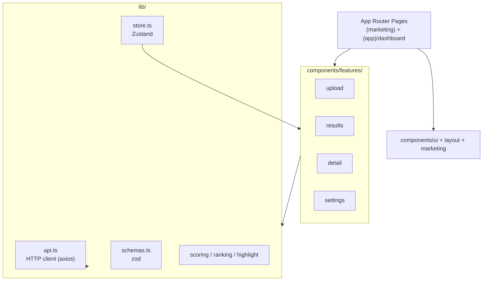
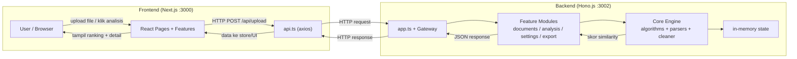

# Frontend — Plagiarism Checker

Aplikasi web **Next.js** (App Router, TypeScript) sebagai antarmuka untuk mendeteksi plagiarisme tugas mahasiswa secara massal. Berkomunikasi dengan backend **Hono.js** via HTTP untuk upload, analisis similarity, dan ekspor laporan.

---

## Tech Stack

| Komponen | Library | Versi |
|----------|---------|-------|
| Framework | Next.js | ^16.2 |
| UI Library | React | ^19.2 |
| Styling | Tailwind CSS | ^4 |
| State Management | Zustand | ^5.0 |
| Data Fetching | TanStack Query | ^5.10 |
| HTTP Client | axios | ^1.16 |
| Icons | lucide-react | ^1.16 |
| Validation | zod | ^4.4 |
| TypeScript | typescript | ^5 |

---

## Struktur Folder

```
frontend/
├── .env / .env.example
├── package.json / tsconfig.json / next.config.ts
└── src/
    ├── app/
    │   ├── (marketing)/        # Landing page (nav, hero, features, cta, promo)
    │   └── (app)/
    │       ├── dashboard/      # Upload + hasil utama
    │       ├── results/        # Ranking & visualisasi
    │       ├── detail/[idA]/[idB]/  # Perbandingan pasangan (side-by-side)
    │       └── settings/       # Threshold & pengecualian
    ├── components/
    │   ├── features/           # upload, results, detail, settings
    │   ├── layout/             # header, container
    │   ├── marketing/          # landing sections + promo player
    │   └── ui/                 # button, card, badge, input, spinner
    ├── lib/
    │   ├── api.ts              # HTTP client ke backend
    │   ├── store.ts            # Zustand state
    │   ├── schemas.ts          # zod validation
    │   ├── scoring.ts          # hitung status similarity
    │   ├── ranking.ts          # ranking per file
    │   └── highlight.ts        # highlight teks mirip
    └── public/promo/           # komposisi video promo (6 frame)
```

---

## Arsitektur Frontend



**Alur internal:** Pages merender feature components → feature memanggil `api.ts` untuk request ke backend → response divalidasi `schemas.ts`, disimpan di `store.ts` (Zustand) → UI (`components/ui`) menampilkan hasil via helper `scoring/ranking/highlight`.

---

## Alur Kerja FE ⇄ Backend



**Langkah:**
1. User upload file (.txt/.docx/.pdf) di halaman dashboard → `POST /api/upload`
2. Backend parse & simpan di memory (`documents` module → `parsers`)
3. User klik "Analisis" → `POST /api/analyze` → backend hitung similarity (TF-IDF cosine + 5-gram + LCS)
4. Frontend ambil `GET /api/results`, `/api/ranking`, `/api/graph` → render tabel, graph, dan detail perbandingan
5. Opsional: `GET /api/export/pdf` untuk unduh laporan

---

## Cara Menjalankan

### Prasyarat
- **Bun** v1.2+ — [Install Bun](https://bun.sh)

### Development

```bash
# dari root (jalankan FE + BE bersamaan)
bun run dev

# atau hanya FE
cd frontend
bun run dev
```

Buka **http://localhost:3000**.

### Build & Produksi

```bash
bun run build
bun start
```

---

## Environment

| Variable | Default | Keterangan |
|----------|---------|------------|
| `FRONTEND_PORT` | `3000` | Port Next.js dev server |
| `NEXT_PUBLIC_API_URL` | `http://localhost:3002/api` | URL backend API |

---

## Konvensi

- Semua teks UI & notifikasi menggunakan **Bahasa Indonesia**.
- Threshold similarity disimpan persisten di `localStorage` (pengaturan klien).
- Ikuti commit convention (lihat `commitlint.config.cjs`) — setiap code commit wajib update `CHANGELOG.md`.
